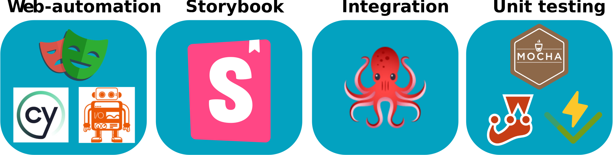

   

# Component Testing with Storybook

   

   

## Setup instructions:

  

Use your IDE of choice - we prefer VSCode
 
Make sure you have Node installed: version 18.17.0
 
 

Clone the repository:
 

__git clone git@github.com:elvirathart/Meetup.git__

 

__npm install__
 
 
If you now get the error that you are still missing the module @reduxjs/toolkit:
 

__npm install @reduxjs/toolkit__
 
 

__npm run dev__
 
open localhost and continue with the instructions there...
